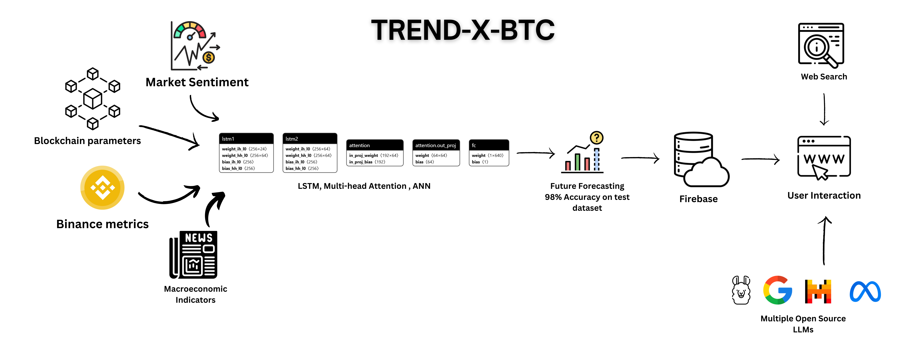

# TREND-X-BTC: Bitcoin 30 Days Forecasting with LSTMs and Multi-Head Attention Mechanism
<div style="width: 400px; height: 300px; overflow: hidden;">
  
</div>


## Table of Contents
- [Overview](#overview)
- [Key Features and Highlights](#key-features-and-highlights)
- [Tech Stack](#tech-stack)
- [Prerequisites](#prerequisites)
- [Installation](#installation)
- [Project Structure](#project-structure)
- [Contributing](#contributing)
  - [Getting Started](#getting-started)
- [License](#license)
- [Contact](#contact)

## Overview
**TREND-X-BTC** is an advanced cryptocurrency price prediction system leveraging LSTM neural networks combined with attention mechanisms to forecast Bitcoin prices with an impressive 98% accuracy. The project leverages market sentiments, macroeconomic factors, blockchain data, and Bitcoin-related datasets from Binance to deliver comprehensive insights and accurate forecasts, empowering users to make confident and informed trading decisions.

### Key Features and Highlights

- **Advanced Data Integration:**  
  Combines market sentiment, blockchain activity, trading volumes, volatility indices, and macroeconomic factors from diverse sources, including Binance, Alternative.me, FRED, CryptoCompare, and Google BigQuery, for comprehensive insights.

- **Sophisticated AI Architecture:**  
  Built with PyTorch, leveraging LSTM and Multi-Head Attention for highly accurate forecasts, powered by GPU acceleration for enhanced performance.

- **Real-time Analysis with Language Models:**  
  Integrates multiple language models (Llama, Gemini, Gemma, Mistral) and web search with citations to ensure  response reflects the latest market trends.

- **Interactive and Intuitive Dashboard:**  
  Offers a user-friendly interface featuring real-time metrics, live price updates, and insightful visualizations for informed decision-making.

- **Automated Workflow:**  
  Implements Windows Scheduler to automate data fetching, preprocessing, and model training, continuously improving prediction accuracy on daily basis.

- **Firebase Integration:**  
  Seamlessly stores data and models, ensuring smooth operational scalability and accessibility.

- **Comprehensive Data Preprocessing:**  
  Ensures data quality through extensive cleaning and augmentation for robust model performance.

## Tech Stack
- **Backend:** PyTorch
- **Frontend:** Next.js with TypeScript
- **Database:** Firebase
- **Data Sources:** Binance, Alternative.me, FRED, CryptoCompare, Google BigQuery

## Prerequisites
### Software:
- Python 3.11+
- CUDA Toolkit (for GPU support)

### Accounts:
- Firebase
- Google Cloud (for BigQuery)

### API Keys:
- Binance
- Alpha Vantage
- CryptoCompare
- FRED

## Installation
### Clone the Repository
```bash
$env:GIT_HTTP_MAX_BUFFER=104857600; git clone --depth 1 https://github.com/mustafahk27/Trend-X-BTC.git
cd Trend-X-BTC
```

### Setting Up the Environment and Running the Project
```bash
# Set Up Virtual Environment
python -m venv venv
source venv/bin/activate  # On Windows: venv\Scripts\activate

# Install Dependencies
pip install -r requirements.txt

# Configure Environment Variables
# Create a .env file in the root directory and add the following:
# BINANCE_API_KEY=your_binance_api_key
# BINANCE_SECRET_KEY=your_binance_secret_key
# NEWS_SENTIMENT_API_KEY=your_alphavantage_api_key
# RSI_API_KEY=your_cryptocompare_api_key
# FRED_API_KEY=your_fred_api_key

# Install PyTorch with CUDA Support
pip install torch torchvision torchaudio --index-url https://download.pytorch.org/whl/cu118

# Verify Installation
python check.py

# Train the Model
python training.py

```

## Project Structure
```bash
Trend-X-BTC/
├── data_generator/         # Data collection and integration
├── data_cleaning/          # Data cleaning utilities
├── DataPreprocessing/      # Data preprocessing and augmentation
├── model_architecture/     # LSTM model implementation
├── Stored_data/            # Local data storage
├── firebase_utils.py       # Firebase integration
├── training.py             # Model training pipeline
├── main.py                 # FastAPI server
├── future_predictions.py   # Prediction generation
├── requirements.txt        # Python dependencies
├── check.py                # Installation check script
└── README.md               # Project documentation
```

## Contributing
### Getting Started
- Fork the repository and clone it locally.
- Create a new branch for your feature or bug fix.
- Commit your changes with descriptive messages.
- Submit a pull request for review.

## License
This project is licensed under the MIT License.

## Contact
For questions, suggestions, or collaboration opportunities, please open an issue or reach out directly at ahsentahir007@email.com.

© 2024 TREND-X-BTC. All rights reserved.
